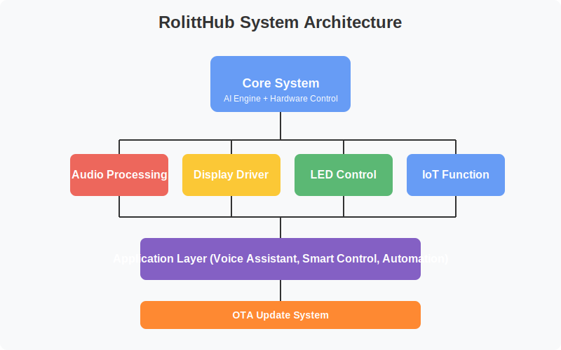

# RolittHub - AI-Powered Smart Hardware Robot  

[English](README.md) | [简体中文](README_CN.md) | [日本語](README_JP.md) | [한국어](README_KR.md)

---

<div align="center">

🤖 **Intelligent Hardware Meets AI Chatbot** 🤖

RolittHub is an open-source AI chatbot project designed for ARM-based hardware platforms, primarily developed in Python. It combines intelligent hardware capabilities with AI chatbot functionality to create an interactive and versatile robot platform.

[www.rolitt.com](https://www.rolitt.com) 🌟

</div>

---

## Key Features 

### Audio Processing 🎤
- Real-time voice recognition and processing
- Multi-language speech recognition ✨
- Noise reduction and echo cancellation 🔇
- Custom wake word detection 🗣️

### Display Driver 🖥️
- Support for various display types (LCD, OLED, etc.)
- Dynamic UI rendering 🎨
- Multi-language character display 🌐
- Custom animation support ✨

### LED Control 💡
- RGB LED status indicators
- Programmable lighting patterns 🌈
- Interactive light feedback ⚡
- Power-efficient LED management 🔋

### IoT Functionality 🌐
- Wi-Fi and Bluetooth connectivity 📡
- Cloud service integration ☁️
- Remote device management 🔄
- Real-time data synchronization 📊

### OTA Updates 🚀
- Secure over-the-air firmware updates 🔒
- Automatic update checking ⚡
- Rollback protection 🛡️
- Update progress monitoring 📈

---

## Supported Hardware

<div align="center">

### 💻 System Requirements

| Component | Minimum Specification |
|-----------|---------------------|
| Processor | ARM-based |
| Memory | 1GB RAM |
| Connectivity | Wi-Fi/Bluetooth |
| Audio | I/O Support |

</div>

---

## Getting Started 🚀

### 1️⃣ Installation

```bash
# Clone the repository
git clone https://github.com/RolittAI/RolittHub.git
cd RolittHub

# Install dependencies
pip install -r requirements.txt
```

---

### 2️⃣ Configuration
- Configure hardware settings in config.yaml
- Verify system environment

---

### 3️⃣ Run
```bash
python main.py
```

---

[](https://opensource.org/licenses/Apache-2.0)
[](https://github.com/RolittAI/RolittHub/actions)
[](https://github.com/RolittAI/RolittHub/issues)
[](https://github.com/RolittAI/RolittHub/stargazers)

## Usage 📱

1. Power on your device and ensure all connections are proper
2. Wait for the system initialization
3. The LED indicator will show the system status
4. Use the wake word to activate the robot
5. Interact with voice commands or through the web interface

---

## Community & Support 👥

- 📢 [GitHub Issues](https://github.com/RolittAI/RolittHub/issues)
- 💬 [Community Forum](https://community.rolitt.com)
- 📚 [Documentation](https://docs.rolitt.com)

---

## License 📄

This project is licensed under the Apache License 2.0.

---

<div align="center">

### 🌟 Thanks to All Contributors and Sponsors 🌟

[Contributing Guidelines](CONTRIBUTING.md) | [Code of Conduct](CODE_OF_CONDUCT.md)

</div>

## System Architecture 

<div align="center">
  
</div>