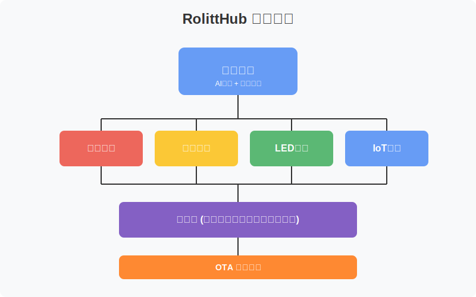

# RolittHub - AI智能硬件机器人 

[English](README.md) | [简体中文](README_CN.md) | [日本語](README_JP.md) | [한국어](README_KR.md)

---

<div align="center">

🌟 **智能硬件与AI聊天机器人的完美结合** 🌟

RolittHub是一个基于ARM平台的开源AI聊天机器人项目，主要使用Python开发。该项目将智能硬件功能与AI聊天机器人技术相结合，打造一个交互式的多功能机器人平台。

[www.rolitt.com](https://www.rolitt.com) 🚀

</div>

---

## 主要功能 

### 音频处理 🎤
- 实时语音识别和处理
- 多语言语音识别 ✨
- 降噪和回声消除 🔇
- 自定义唤醒词检测 🗣️

### 显示驱动 🖥️
- 支持多种显示设备（LCD、OLED等）
- 动态UI渲染 🎨
- 多语言字符显示 🌐
- 自定义动画支持 ✨

### LED控制 💡
- RGB LED状态指示
- 可编程灯光模式 🌈
- 交互式灯光反馈 ⚡
- 节能LED管理 🔋

### IoT功能 🌐
- Wi-Fi和蓝牙连接 📡
- 云服务集成 ☁️
- 远程设备管理 🔄
- 实时数据同步 📊

### OTA升级 🚀
- 安全的空中固件更新 🔒
- 自动更新检查 ⚡
- 回滚保护 🛡️
- 更新进度监控 📈

---

## 支持的硬件
### 💻 系统要求

| 组件 | 最低配置 |
|------|----------|
| 处理器 | ARM架构（全志、ROCKCHIP） |
| 内存 | 1GB RAM |
| 连接 | Wi-Fi/蓝牙 |
| 音频 | 输入输出支持 |

### 🛠️ 硬件优化

- 屏幕驱动优化
- 舵机控制优化
- 传感器集成（陀螺仪、加速度计等）
- 麦克风阵列优化
- 扬声器音质优化

### 🤖 AI功能

- OTA在线升级
- AI SAAS服务对接

</div>

---

## 快速开始 🚀

### 1️⃣ 安装

```bash
# 克隆仓库
git clone https://github.com/RolittAI/RolittHub.git
cd RolittHub

# 安装依赖
pip install -r requirements.txt
```

---

### 2️⃣ 配置
- 在config.yaml中配置硬件设置
- 验证系统环境

---

### 3️⃣ 运行
```bash
python main.py
```

---

## 使用说明 📱

1. 开启设备并确保所有连接正常
2. 等待系统初始化
3. LED指示灯将显示系统状态
4. 使用唤醒词激活机器人
5. 通过语音命令或Web界面进行交互

---

## 社区与支持 👥

- 📢 [GitHub Issues](https://github.com/RolittAI/RolittHub/issues)
- 💬 [社区论坛](https://community.rolitt.com)
- 📚 [文档中心](https://docs.rolitt.com)

## 许可证 📄

本项目采用Apache License 2.0许可证。

---

<div align="center">

### 🌟 感谢所有贡献者和赞助商 🌟

[贡献指南](CONTRIBUTING.md) | [行为准则](CODE_OF_CONDUCT.md)

</div>

## 系统架构 

<div align="center">
  
</div>

## 主要功能 