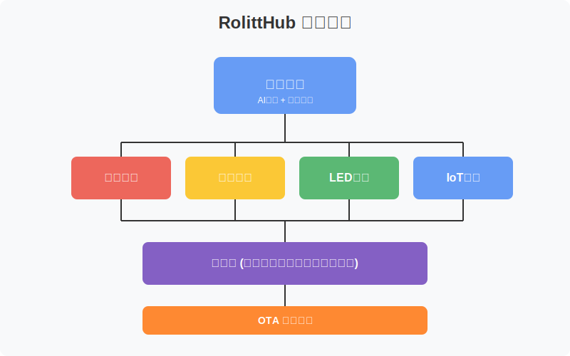

# RolittHub - AIスマートハードウェアロボット 

[English](README.md) | [简体中文](README_CN.md) | [日本語](README_JP.md) | [한국어](README_KR.md)

---

<div align="center">

🤖 **インテリジェントハードウェアとAIチャットボットの融合** 🤖

RolittHubは、ARMプラットフォームベースのオープンソースAIチャットボットプロジェクトで、主にPythonで開発されています。このプロジェクトは、インテリジェントハードウェア機能とAIチャットボット機能を組み合わせ、インタラクティブな多機能ロボットプラットフォームを実現します。

[www.rolitt.com](https://www.rolitt.com) 🌟

</div>

---

## 主な機能 

### 音声処理 🎤
- リアルタイム音声認識と処理
- 多言語音声認識 ✨
- ノイズ削減とエコーキャンセル 🔇
- カスタムウェイクワード検出 🗣️

### ディスプレイドライバ 🖥️
- 各種ディスプレイタイプ対応（LCD、OLEDなど）
- 動的UIレンダリング 🎨
- 多言語文字表示 🌐
- カスタムアニメーション対応 ✨

### LED制御 💡
- RGB LED状態表示
- プログラム可能な照明パターン 🌈
- インタラクティブな光フィードバック ⚡
- 省電力LED管理 🔋

### IoT機能 🌐
- Wi-FiとBluetooth接続 📡
- クラウドサービス統合 ☁️
- リモートデバイス管理 🔄
- リアルタイムデータ同期 📊

### OTAアップデート 🚀
- 安全な無線ファームウェアアップデート 🔒
- 自動アップデートチェック ⚡
- ロールバック保護 🛡️
- アップデート進捗モニタリング 📈

---

## 対応ハードウェア

<div align="center">

### 💻 システム要件

| コンポーネント | 最小仕様 |
|--------------|----------|
| プロセッサ | ARM ベース |
| メモリ | 1GB RAM |
| 接続 | Wi-Fi/Bluetooth |
| オーディオ | 入出力対応 |

</div>

---

## はじめに 🚀

### 1️⃣ インストール

```bash
# リポジトリのクローン
git clone https://github.com/RolittAI/RolittHub.git
cd RolittHub

# 依存関係のインストール
pip install -r requirements.txt
```

---

### 2️⃣ 設定
- config.yamlでハードウェア設定を構成
- システム環境の確認

---

### 3️⃣ 実行
```bash
python main.py
```

---

## 使用方法 📱

1. デバイスの電源を入れ、すべての接続が正しいことを確認
2. システム初期化の待機
3. LED表示でシステム状態を確認
4. ウェイクワードでロボットを起動
5. 音声コマンドまたはWebインターフェースで操作

---

## コミュニティとサポート 👥

- 📢 [GitHub Issues](https://github.com/RolittAI/RolittHub/issues)
- 💬 [コミュニティフォーラム](https://community.rolitt.com)
- 📚 [ドキュメント](https://docs.rolitt.com)

## システムアーキテクチャ 

<div align="center">
  
</div>

## 主要功能 

### OTAアップデート 🚀
- 安全な無線ファームウェアアップデート 🔒
- 自動アップデートチェック ⚡
- ロールバック保護 🛡️
- アップデート進捗モニタリング 📈

---

## コミュニティとサポート 👥

- 📢 [GitHub Issues](https://github.com/RolittAI/RolittHub/issues)
- 💬 [コミュニティフォーラム](https://community.rolitt.com)
- 📚 [ドキュメント](https://docs.rolitt.com)

## ライセンス 📄

このプロジェクトはApache License 2.0の下でライセンスされています。

---

<div align="center">

### 🌟 すべての貢献者とスポンサーに感謝いたします 🌟

[貢献ガイドライン](CONTRIBUTING.md) | [行動規範](CODE_OF_CONDUCT.md)

</div>